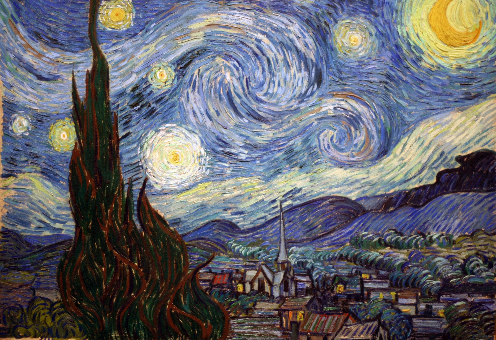
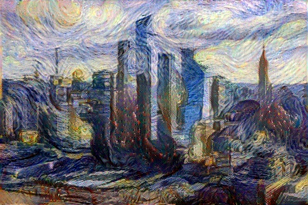

# tf2-neural-style-transfer

使用Tensorflow 2.0实现的图片风格迁移Demo。

给定一张内容图片和一张风格图片，生成一张具备内容图片内容+风格图片风格的图片。

风格图片示例：



示例1：

输入图片


输出图片



示例2：

输入图片


输出图片


# 快速开始

开发环境:

Python 3.7 (Anaconda安装的)

1.clone 项目：

```git clone https://github.com/AaronJny/DeepLearningExamples.git```

2.切换到子项目根目录：

```cd DeepLearningExamples/tf2-neural-style-transfer```

3.安装依赖环境：

```pip install -r requirements.txt```

4.根据个人需求，修改`settings.py`中的配置参数。

5.运行训练脚本：

```python train.py```

运行成功则会输出训练进度：

```
Epoch 1/20: 100%|██████████| 100/100 [00:09<00:00, 10.37it/s, loss=22066.4688]
Epoch 2/20: 100%|██████████| 100/100 [00:07<00:00, 13.09it/s, loss=12479.9658]
Epoch 3/20: 100%|██████████| 100/100 [00:07<00:00, 13.06it/s, loss=9065.9258]
Epoch 4/20: 100%|██████████| 100/100 [00:07<00:00, 13.06it/s, loss=6993.3652]
Epoch 5/20: 100%|██████████| 100/100 [00:07<00:00, 13.02it/s, loss=5558.0947]
Epoch 6/20: 100%|██████████| 100/100 [00:07<00:00, 13.03it/s, loss=4526.5439]
Epoch 7/20: 100%|██████████| 100/100 [00:07<00:00, 13.01it/s, loss=3777.7947]
Epoch 8/20: 100%|██████████| 100/100 [00:07<00:00, 13.00it/s, loss=3228.8064]
Epoch 9/20: 100%|██████████| 100/100 [00:07<00:00, 12.98it/s, loss=2821.5425]
Epoch 10/20: 100%|██████████| 100/100 [00:07<00:00, 12.98it/s, loss=2515.5208]
Epoch 11/20: 100%|██████████| 100/100 [00:07<00:00, 12.97it/s, loss=2278.1858]
Epoch 12/20: 100%|██████████| 100/100 [00:07<00:00, 12.96it/s, loss=2090.5942]
Epoch 13/20: 100%|██████████| 100/100 [00:07<00:00, 12.95it/s, loss=1939.2296]
Epoch 14/20: 100%|██████████| 100/100 [00:07<00:00, 12.95it/s, loss=1813.9688]
Epoch 15/20: 100%|██████████| 100/100 [00:07<00:00, 12.94it/s, loss=1708.0551]
Epoch 16/20: 100%|██████████| 100/100 [00:07<00:00, 12.93it/s, loss=1628.9713]
Epoch 17/20: 100%|██████████| 100/100 [00:07<00:00, 12.93it/s, loss=1545.6821]
Epoch 18/20: 100%|██████████| 100/100 [00:07<00:00, 12.93it/s, loss=1917.6001]
Epoch 19/20: 100%|██████████| 100/100 [00:07<00:00, 12.91it/s, loss=1416.0177]
Epoch 20/20: 100%|██████████| 100/100 [00:07<00:00, 12.91it/s, loss=1359.5453]

Process finished with exit code 0
```

训练完成后在输出目录（默认`./output`）下能看到生成的图片，默认每个epoch保存一次生成的图片。


# 更多信息

请访问博客：

[有趣的深度学习——使用TensorFlow 2.0实现图片神经风格迁移](https://www.aaronjny.com/articles/2020/03/15/1584256301112.html) (https://www.aaronjny.com/articles/2020/03/15/1584256301112.html)

或

[有趣的深度学习——使用TensorFlow 2.0实现图片神经风格迁移](https://blog.csdn.net/aaronjny/article/details/104879258) (https://blog.csdn.net/aaronjny/article/details/104879258)
